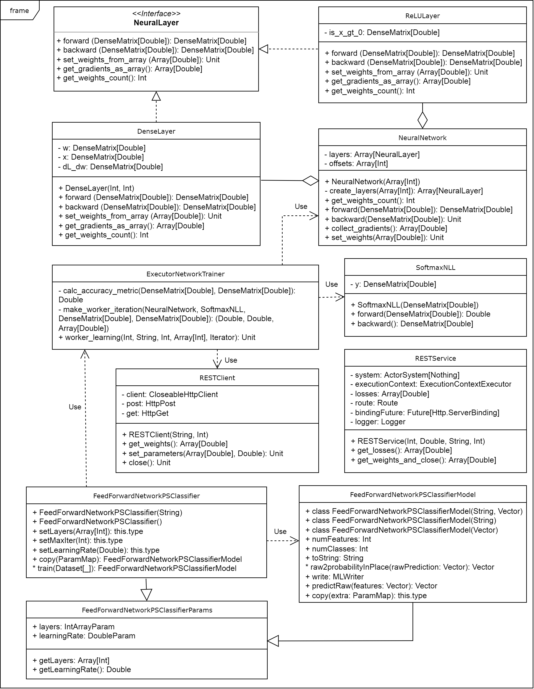
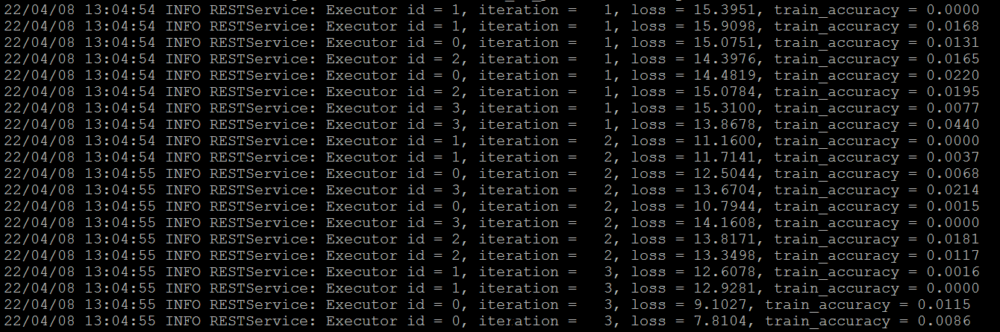
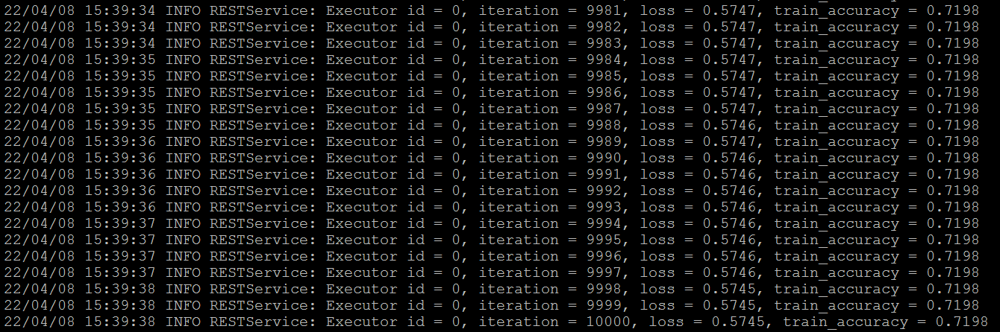
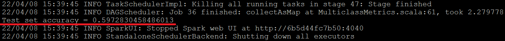
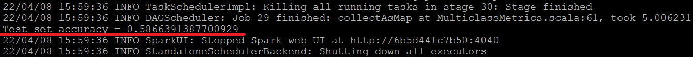

## Домашнее задание № 3 по курсу "MLOps"
### Реализация собственного модуля SparkML
#### Автор: Кравченя Павел

#### Цели работы
Реализация расширения функционала SparkML своими алгоритмами.

#### Постановка задачи

Используя отобранный в модуле 2 датасет (показы ленты социальной сети ok.ru), реализовать свой модуль SparkML для реализации модели нейронной сети с параметр-сервером.

Как показало проведенное исследование при выполнении модуля 2, целевой переменной можно считать столбец `instanceId_userId`, обозначающий Id пользователя, просматривающего контент. Поэтому, в терминах машинного обучения поставленная задача предсказания пользователя по некоторым остальным признакам в датасете является задачей `multiclass classification`.

### Архитектура нейронной сети

В работе реализован модуль многосолойного перцептрона, представляющий собой несколько полносвязных нейронных сетей с функцией активации ReLU. Количество слоев можно задать в настройках модуля. Для решения задачи классификации в конце нейронной сети устанавливается совмещенный слой `Softmax + NLL`.


### Математическая модель

#### Прямой и обратный проход для полносвязного слоя
Линейное преобразование признаков полносвязного слоя может быть записано в виде:

$$y = xw, \; y \in \mathbb{R}^{m \times n}, \; x \in \mathbb{R}^{m \times d}, \; w \in \mathbb{R}^{d \times n} $$

Вычислим производные функции ошибки по входам. Будем использовать [номинаторную](https://en.wikipedia.org/wiki/Matrix_calculus#Numerator-layout_notation) нотацию, согласно которой:

$$\left( \frac{\partial L}{\partial w} \right)_{ij} = \frac{\partial L}{\partial w_{ji}}$$

Учитывая, что $L = L \left( y_{11}\left(x_{ji}\right), y_{12}\left(x_{ji}\right), y_{21}\left(x_{ji}\right), ... \right)$, воспользуемся выражением для производной сложной функции:

$$\left( \frac{\partial L}{\partial w} \right)_{ij} = \frac{\partial L}{\partial w_{ji}} = \sum_p \sum_q { \frac{\partial L}{\partial y_{pq}}  \frac{\partial y_{pq}}{\partial w_{ji}} } = \sum_p \sum_q { \frac{\partial L}{\partial y_{pq}}  \frac{\partial }{\partial w_{ji}} \left( \sum_k {x_{pk} w_{kq}} \right) } = \sum_p \sum_q { \frac{\partial L}{\partial y_{pq}}  \sum_k{x_{pk} \frac{\partial w_{kq}}{\partial w_{ji}}} } $$

Принимая во внимание, что все $w_{rs}$ функционально друг с другом не связаны, и производная $\frac{\partial w_{kq}}{\partial w_{ji}}$ отлична от нуля только при $k=j$, $q=i$, получаем, что из суммы по $k$ останется только одно слагаемое. Тогда:

$$\left( \frac{\partial L}{\partial w} \right)_{ij} = \sum_p { \frac{\partial L}{\partial y_{pi}} x_{pj}} = \sum_p { \left( \frac{\partial L}{\partial y} \right)_{ip} x_{pj}}$$

В векторном виде соотношение примет вид:

$$\frac{\partial L}{\partial w} = \frac{\partial L}{\partial y} x$$

Аналогичным образом находим производную по $x$:

$$\left( \frac{\partial L}{\partial x} \right)_{ij} = \frac{\partial L}{\partial x_{ji}} = \sum_p \sum_q { \frac{\partial L}{\partial y_{pq}}  \frac{\partial y_{pq}}{\partial x_{ji}} } = \sum_p \sum_q { \frac{\partial L}{\partial y_{pq}}  \frac{\partial }{\partial x_{ji}} \left( \sum_k {x_{pk} w_{kq}} \right) } = \sum_p \sum_q { \frac{\partial L}{\partial y_{pq}}  \sum_k{w_{kq} \frac{\partial x_{pk}}{\partial x_{ji}}} } = $$

$$ = \sum_q { \frac{\partial L}{\partial y_{jq}} w_{iq}} = \sum_q { \left( \frac{\partial L}{\partial y} \right)_{qj} w_{iq}} = \sum_q { w_{iq} \left( \frac{\partial L}{\partial y} \right)_{qj} }$$

Или, в векторном виде:

$$\frac{\partial L}{\partial x} = w \frac{\partial L}{\partial y}$$

#### Прямой и обратный проход для функции активации ReLU

ReLU-функция применяется поэлементно к матрице входных значений, что может быть записано с применением нотации Айверсона:

$$y = ReLU \left( x \right) = \max(0, x) = x \odot \left[ x > 0 \right], \; y \in \mathbb{R}^{m \times n}, \; x \in \mathbb{R}^{m \times n}$$

ReLU-функция не содержит обучаемых параметров (весов). Поэтому, нужно выразить только производную от функции ошибки по входу:

$$\left( \frac{\partial L}{\partial x} \right)_{ij} = \frac{\partial L}{\partial x_{ji}} = \sum_p \sum_q { \frac{\partial L}{\partial y_{pq}}  \frac{\partial y_{pq}}{\partial x_{ji}} } = \sum_p \sum_q { \frac{\partial L}{\partial y_{pq}}  \frac{\partial  \max \left( 0, x_{pq} \right)}{\partial x_{ji}}} = \frac{\partial L}{\partial y_{ji}}  [x_{ji} > 0] = \left( \frac{\partial L}{\partial y} \right)_{ij} \left[x^T_{ij} > 0 \right]$$

Векторное выражение производной:

$$\frac{\partial L}{\partial x} = \frac{\partial L}{\partial y} \odot \left[ x^T > 0 \right]$$

#### Прямой и обратный проход для совмещенного слоя softmax-NLL

Функция ошибки NLL может быть записана в виде:
$$L\left( y, t \right) = - \frac{1}{m} \sum_{p=1}^{m} \sum_{q=1}^{C} {t_{pq} \log{y_{pq}}}, \quad y, t \in \mathbb{R}^{m \times d}$$

Входом $y$ данной функции служат выходы функции $softmax(x)$:

$$y = softmax(x) = \left\{ \frac{1}{\sum_k{e^{x_{ik}}}} \cdot \left[ e^{x_{i1}}, e^{x_{i2}}, e^{x_{i3}} ... e^{x_{id}}\right]   \right\}_{i=1}^{m}, \quad x \in \mathbb{R}^{m \times d}$$

Матрица $t_{pq}$ представляет собой `one-hot`-кодировку метки из $C$ классов для объекта $p$.

Непосредственное вычисление функции `softmax` может быть численно неустойчивым. Поэтому, принято данную функцию записывать в эквивалентном виде:

$$softmax(x) = \left\{ \frac{1}{\sum_k{e^{x_{ik} - x_i^{max}}}} \cdot \left[ e^{x_{i1} - x_i^{max}}, e^{x_{i2} - x_i^{max}}, e^{x_{i3} - x_i^{max}} ... e^{x_{id} - x_i^{max}}\right]   \right\}_{i=1}^{m},$$

где 

$$x_i^{max} = \max_k \left( x_{ik} \right), \quad x \in \mathbb{R}^{m \times d}, \quad x^{max} \in \mathbb{R}^m$$

Таким образом, замена $x \rightarrow x'$, где $x' = \left\{ x_i - x^{max} \right\}_{i=1}^m$ не приводит к изменению значения функции `softmax`, но приводит к ее численной устойчивости для бОльшего диапазона изменения аргумента.

Тогда прямой проход будет выполняться следующим образом:

$$L\left( x, t \right) = - \frac{1}{m} \sum_{p=1}^{m} \sum_{q=1}^{C} {t_{pq} \log{\left[ \frac{e^{x'_{pq}}}{\sum_k{e^{x'_{pk}}}} \right]}} = - \frac{1}{m} \sum_{p=1}^{m} \sum_{q=1}^{C} {t_{pq} x'_{pq}} + \frac{1}{m} \sum_{p=1}^{m} {\log \sum_k{e^{x'_{pk}}}} =  - \frac{1}{m} \sum_{p=1}^{m} \sum_{q=1}^{C} {\left( t \odot x' \right)_{pq}} + \frac{1}{m} \sum_{p=1}^{m} {\log \sum_k{e^{x'_{pk}}}} $$

Совмещенный слой sortmax-NLL не содержит обучаемых весов. Поэтому, для шага `backward` поторебуется только производная от функции ошибки по $x$.

$$\left(\frac{\partial L}{\partial x} \right)_{ij} = \frac{\partial L}{\partial x_{ji}} = - \frac{1}{m} \sum_{p=1}^{m} \sum_{q=1}^{C} {t_{pq} \frac{\partial \log{y_{pq}}}{\partial x_{ji}}} = - \frac{1}{m} \sum_{p=1}^{m} \sum_{q=1}^{C} { \frac{t_{pq}}{y_{pq}} \frac{\partial y_{pq}}{\partial x_{ji}}} = - \frac{1}{m} \sum_{p=1}^{m} \sum_{q=1}^{C} { \frac{t_{pq}}{y_{pq}} \frac{\partial}{\partial x_{ji}} \left[ \frac{e ^{x_{pq}}}{\sum_k{e ^{x_{pk}}}} \right]} = $$

$$ = - \frac{1}{m} \sum_{p=1}^{m} \sum_{q=1}^{C} { \frac{t_{pq}}{y_{pq}} \frac{e^{x_{pq}} \frac{\partial x_{pq}}{\partial x_{ji}} \cdot \sum_k{e^{x_{pk}}} - e^{x_{pq}} \cdot \sum_k{e^{x_{pk}} \frac{\partial x_{pk}}{\partial x_{ji}}} }{\sum_k{e ^{x_{pk}}} \cdot \sum_k{e ^{x_{pk}}}}  }  = - \frac{1}{m} \sum_{p=1}^{m} \sum_{q=1}^{C} { \frac{t_{pq}}{y_{pq}} \frac{e^{x_{pq}}}{ \sum_k{e ^{x_{pk}}} } \frac{\partial x_{pq}}{\partial x_{ji}} - \frac{1}{m} \sum_{p=1}^{m} \sum_{q=1}^{C} { \frac{t_{pq}}{y_{pq}} \frac{e^{x_{pq}}}{\sum_k{e ^{x_{pk}}} } \frac{ \sum_k{e ^{x_{pk}}} \frac{\partial x_{pk}}{\partial x_{ji}}}{\sum_k{e ^{x_{pk}}} }  } } = $$

$$ = - \frac{1}{m} \frac{t_{ji}}{y_{ji}} \frac{e^{x_{ji}}}{ \sum_k{e ^{x_{jk}}}} + \frac{1}{m} \sum_{q=1}^{C} { \frac{t_{jq}}{y_{jq}} \frac{e^{x_{jq}}}{ \sum_k{e ^{x_{jk}}}} \frac{e^{x_{ji}}}{ \sum_k{e ^{x_{jk}}}}  } = - \frac{1}{m} \frac{t_{ji}}{y_{ji}} y_{ji} + \frac{1}{m} \sum_{q=1}^{C}{ \frac{t_{jq}}{y_{jq}} y_{jq} y_{ji} } = - \frac{1}{m} t_{ji} + \frac{1}{m} \sum_{q=1}^{C}{ t_{jq} y_{ji} } = $$

$$ = - \frac{1}{m} t_{ji} + \frac{1}{m} y_{ji} \sum_{q=1}^{C}{ t_{jq} } = - \frac{1}{m} t_{ji} + \frac{1}{m} y_{ji} = \frac{1}{m} \left( y_{ji} - t_{ji} \right) = \frac{1}{m} \left( y - t \right)_{ji} = \frac{1}{m} \left( y - t \right)^T_{ij}$$

В векторном виде выражение запишется в виде:

$$\frac{\partial L}{\partial x} = \frac{1}{m} \left( y - t \right)^T,$$

где $y = softmax(x) = softmax(x')$.

### Реализация параметр-сервера

Параметр-сервер в работе выполнен в виде REST-сервиса, поддерживающего две операции:
1. **PUSH** -- для отправки градиентов и вспомогательных параметров (executor id, значение ошибки, доля верных ответов при обучении) сервису. Реализован в виде обработчика запроса HTTP POST по адресу `/api/gradients`, в котором требуемые данные передаются как JSON.
2. **PULL** -- для получения клиентом обновленных весов нейросети. Реализован в виде обработчика запроса HTTP GET по адресу `/api/weights`, который формирует ответ с передаваемыми данными в формате JSON.

Параметр-сервер запускается на драйвере. Он обеспечивает изначальную инициализацию весов, которые будут запрошены клиентами на executor'ах, и выполняет обновление весов после каждого получения градиентов от клиентов, реализуя стратегию распределенного асинхронного обучения. При получении от клиента градиентов и параметров последние выводятся на экран для контроля процесса обучения.

### Архитектура модуля

Модуль реализован в виде набора классов, UML-диаграмма которых представлена на рисунке.



* Интерфейс `NeuraLayer` определяет набор методов, реализующих функциональность слоев `DenseLayer` и `ReLULayer`. Для каждого из этих слоев можно вычислить прямой и обратный проходы (в соответствии с формулами, приведенными выше), получить градиенты функции потерь по весам слоя в виде массива для отправки на параметр-сервер, установить множество весов слоя, полученных с параметр-сервера и определить количество весов.

* Класс `NeuralNetwork` объединяет все слои в единую нейросеть и предоставляет методы для обучения весов и предсказания результатов, а также для послойной установки весов и извлечения градиентов.

* Класс `SoftmaxNLL` реализует расчет ошибки нейросети и включает в себя методы для прямого и обратного прохода.

* Класс `RestService` реализует REST-сервис на основе `akka.http` для хранения и обновления весов в соответствии со значениями градиентов, полученных от клиентов.

* Класс `RestClient` содержит методы по удаленному взаимодействию с REST-сервисом и обмена информацией с ним в процессе обучения нейросети.

* Класс `ExecutorNetworkTrainer` реализует методы, запускающиеся на executor'ах и выполняющие цикл итераций расчета значений ошибки и градиентов от функции ошибки по весам над своей частью датасета, а также обеспечивающие взаимодействие с REST-сервисом посредством REST-клиента.

* Класс `FeedForwardNetworkPSClassifier` является основным классом модуля, реализующим методы для выполнения классификации. Результатом обучения классификатора является модель, представленная классом `ProbabilisticClassificationModel`. Как классификатор, так и модель разделяют параметры, определенные в классе `FeedForwardNetworkPSClassifierParams`.

### Использование модуля

Созданный модуль нейросетевого классификатора с параметр-сервером может использоваться при построении конвейеров обработки данных. Пример использования модуля приведен в классе `MainApp`. Этот класс реализует процесс извлечения признаков из датасета, их предобработки, обучения на них разработанного классификатора с последущей валидацией. Классификатор содержит несколько параметров, которые могут быть настроены перед его использованием:
```
new FeedForwardNetworkPSClassifier()
  .setLayers(Array[Int](6, 50, 200, 50, 100))
  .setMaxIter(10000)
  .setLearningRate(0.005)
  .setFeaturesCol("features")
  .setLabelCol("instanceId_userId_labels")
```

При необходимости, модель классификатора может быть сохранена в файловую систему и впоследствии загружена для дальнейшего использования.

### Сборка и запуск классификатора

Модуль реализован в виде Spark-приложения под управлением `sbt`. Для тестирования проекта и сборки Uber-Jar нужно в консоль sbt ввести команду:
```
test / assembly
```

Тестирование работоспособности приложения осуществлялось в среде Spark 3.2.1, [запущенной под Docker](https://hub.docker.com/r/bitnami/spark) на многопроцессорном сервере под управлением CentOS 7.

DockerCompose имеет вид:
```
version: '2'

services:
  spark:
    image: docker.io/bitnami/spark:3.2.1
    environment:
      - SPARK_MODE=master
      - SPARK_RPC_AUTHENTICATION_ENABLED=no
      - SPARK_RPC_ENCRYPTION_ENABLED=no
      - SPARK_LOCAL_STORAGE_ENCRYPTION_ENABLED=no
      - SPARK_SSL_ENABLED=no
    ports:
      - '8087:8080'
    volumes:
      - <your host directory>:/tmp/kpd
  spark-worker:
    image: docker.io/bitnami/spark:3.2.1
    environment:
      - SPARK_MODE=worker
      - SPARK_MASTER_URL=spark://spark:7077
      - SPARK_WORKER_MEMORY=32G
      - SPARK_WORKER_CORES=2
      - SPARK_RPC_AUTHENTICATION_ENABLED=no
      - SPARK_RPC_ENCRYPTION_ENABLED=no
      - SPARK_LOCAL_STORAGE_ENCRYPTION_ENABLED=no
      - SPARK_SSL_ENABLED=no
    volumes:
      - <your host directory>:/tmp/kpd
```

Запуск кластера Spark выполняется следующей командой:
```
 docker-compose up --scale spark-worker=4 -d
```

Запуск приложения в среде Spark для **обучения модели** осуществляется следующим образом:
```
spark-submit --master spark://spark:7077 --driver-memory 16g --executor-memory 16g ./FeedForwardNetworkPS-assembly-1.0.jar --mode train --dir trained-model sna-hackathon-2019/train
```
Здесь `trained-model` -- директория, в которую будут сохранены параметры обученной модели, `sna-hackathon-2019/train` -- директория с тренировочной частью датасета модуля 2.

Запуск приложения для **тестирования обученной модели** осуществляется следующим образом:
```
spark-submit --master spark://spark:7077 --driver-memory 16g --executor-memory 16g ./FeedForwardNetworkPS-assembly-1.0.jar --mode predict --dir trained-model sna-hackathon-2019/test
```

### Результаты тестирования работоспособности

Тестирование работоспособности нейросетевого классификатора осуществлялось со следующими значениями параметров:
```
Размеры полновсязных слоев в нейросети: (6, 50, 200, 50, 100)
Максимальное число итераций обучения над каждым разделом данных: 10000
Скорость обучения (learning rate): 0.005
```

Сразу после начала обучения веса являются произвольными, а метрика доли верных ответов (`accuracy`) на тренировочной выборке довольно низкая.



В процессе обучения ошибка уменьшается, а `accuracy` возрастает.



После окончания обучения `accuracy` на обучающей выборке достигает некоторого значения. В работе не выполнялся подбор гиперпараметров для достижения налучшей точности, а просто проверялась корректность работы классификатора. После окончания процесса обучения модели рассчитывается доля верных ответов на валидационной части датасета.



После загрузки обученной модели и выполнения предсказания рассчитывается `accuracy` на тестовой части датасета. Она оказывается меньше, чем доля верных ответов на тренировочной выборке, что свидетельствует о переобучении модели. Борьба с переобучением в данной работе не рассматривается.



Видно, что значения метрики на валидационной и тестовой частях датасета примерно совпадают, что косвенно свидетельствует о корректности сохранения и загрузки обученной модели.

### Выводы

В данной работе был спроектирован и разработан нейросетевой классификатор с параметр-сервером как модуль библиотеки Spark ML. Работоспособность модуля проверена на датасете с информацией о показах ленты социальной сети ok.ru. Специальной настройки архитектуры нейросети с целью получения наилучших значений метрик не проводилось, результаты оценивались визуально по уменьшению ошибки и возрастанию точности при обучении. После обучения модель была провалидирована и сохранена в файловую систему, откуда успешно была считана и использована для выполнения классификации данных.