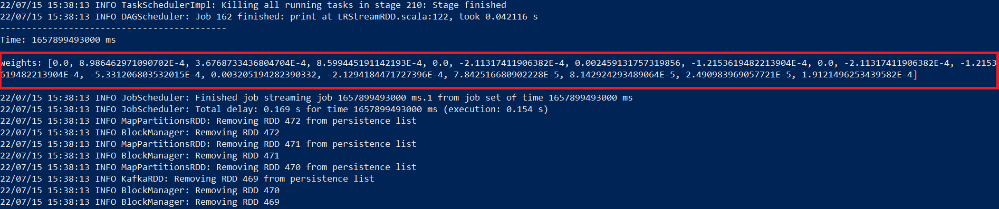

### Домашнее задание № 4 по курсу "MLOps"
#### Использование Spark Streaming для потокового обучения моделей
##### Автор: Кравченя Павел

##### Цели работы:
Потренироваться в использовании Spark Streaming для предобработки данных и обучения модели линейной регрессии.

##### Постановка задачи:

1. Скачать данные о показах ленты социальной сети `ok.ru` ([SNA Hackathon 2019](https://www.kaggle.com/sharthz23/sna-hackathon-2019-collaboration)).

2. Подготовить эмуляцию проигрывания датасета.

3. Реализовать подготовку признаков для модели линейной регрессии.

4. Реализовать обновление коэффициентов линейной регрессии в потоке с дополнительной регуляризацией на отклонение от базы.

##### Решение:

`Замечание` В процессе выполнения задания возникли трудности с выбором способа его решения:

1. Попытки обучить модель в режиме Structural Streaming приводят к возникновению ошибки:

`ERROR Instrumentation: org.apache.spark.sql.AnalysisException: Queries with streaming sources must be executed with writeStream.start();kafka`

В Stack trace можно видеть, что исключение возникает в методе fit() при попытке начать обучение. Предположительно, в данном методе происходит вызов действия, которое разветвляет `query plan`, и для этой ветви вызов `writeStream.start()` не выполняется.

2. Применение метода `ForeachBatch` позволяет выполнить обучение модели в потоке, однако, для каждого батча модель обучается заново. Дообучения модели не происходит, а инициализировать модель при обучении не представляется возможным, поскольку метода инициализации весов у класса линейной регрессии нет. Выходом из ситуации могла бы стать разработка собственного модуля LR, эту инициализацию поддерживающую.

3. Применение класса `StreamingLinearRegressionWithSGD` позволяет выполнить обучение и дообучение модели в потоке, однако, этот класс базируется только на `DStreams`, датафреймы не поддерживаются. А подход с использованием `DStreams` не позволяет использовать классы для преобразования признаков из библиотеки `ml`. Поэтому, использование этого подхода предполагает создание собственных функций для работы с признаками.

Из представленных подходов был выбран третий как наименее трудоемкий. В качестве задачи линейной регрессии было решено предсказывать количество фотографий пользователя `"metadata_numPhotos"` по нескольким отобранным из датасета признакам. Проект реализован с использованием IntelliJ IDEA с плагином для языка Scala.

##### Реализация проигрывания датасета

В работе данные, которые `Apache Spark` анализирует в потоковом режиме, подаются ему на вход через `Apache Kafka`. Приложение `SparkSteamingKafkaSNA` является потребителем данных из Кафки, а источником служит скрипт `sna_producer.py`, который загружает данные из файлов датасета, отбирает признаки и отправляет их в Кафку.

В качестве признаков для анализа были выбраны следующие:

`"audit_clientType", "instanceId_objectType", "audit_resourceType", "auditweights_numDislikes", "auditweights_ctr_negative", "auditweights_numLikes", "metadata_numSymbols"`

Первые три признака являются категориальными, а остальные -- количественными.

Для запуска скрипта следует выполнить команду:

`python ./sna-producer.py -d <directory with dataset> -b <kafka-boostrap-servers> -t <kafka-topic>`

##### Реализация подготовки признаков

Как упоминалось ранее, для обработки признаков потребовалось реализовать собственные функции. Категориальные признаки были закодированы с помощью `One-Hot encoding`, а количественные -- отмасштабированы посредством `MinMax scaling`. Количество категорий, минимальные и максимальные значения признаков были определены на этапе разведовательного анализа данных и прописаны в программном коде проекта, поскольку в потоковом режиме определить эти значения на всех данных в потоке не представлялось возможным.

##### Реализация обучения линейной регрессии в потоке с регуляризацией

Обучение линейной регрессии в потоке было реализовано в программном коде проекта `SparkStreamingKafkaSNA` на основе `DStreams` с использованием класса `StreamingLinearRegressionWithSGD`. Данный класс поддерживает как начальную инициализацию весов, так и регуляризацию. В процессе обработки потоковых данных линейная регрессия обучается, а ее коэффициенты выводятся на экран, как показано на рисунке ниже.

##### Выводы:

В процессе выполнения работы был реализован проект по обучению линейной регрессии в потоковом режиме с регуляризацией с использованием `Spark Streaming`. Был разработан скрипт, позволяющий читать файлы датасета, отбирать требуемые признаки и отправлять их в `Apache Kafka`. В потоковом режиме эти данные были приняты приложением, подготовлены для модели линейной регрессии и использованы для обучения.
