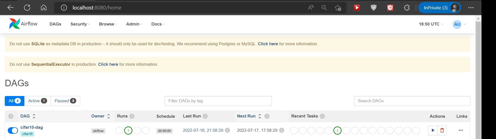
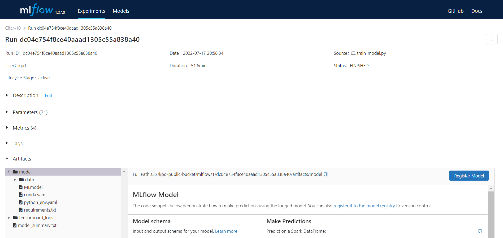
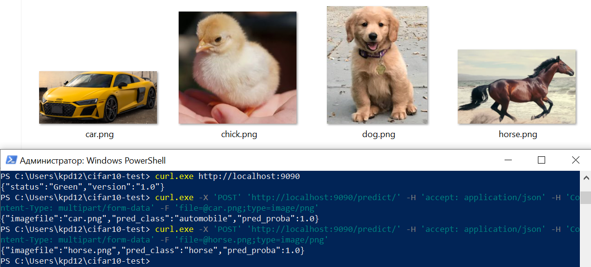

### Домашнее задание № 6 по курсу "MLOps"
#### End2end мл
##### Автор: Кравченя Павел

##### Цели работы:
Реализовать обучение и сервинг модели, соединить их.

##### Постановка задачи:

1. Взять любой датасет, можно взять один из ранее используемых в ДЗ, либо любой из `https://www.kaggle.com/datasets`, выделить таргет на регресию или классификацию.

2. Реализовать пайплайн на `airflow`, который содержит минимум два шага:

- готовит данные (извлекает признаки, делит на треин, валидацию, тест и т.д.)
- обучает модель. По желанию, можно добавить работу с `mlflow` (логирование метрик, сохранение артефакта, использование model registry).

3. На основе артефакта, который получился в результате шага 2, реализовать онлайн сервинг (сервер, который обрабатывает запросы онлайн или кафка-потребитель, по аналогии с лекцией).

Решение должно быть выполнено в виде git-репозитория, содержащего весь необходимый код и инструкцию по развертке. Дополнительные артефакты (например, файлы модели), в случае необходимости необходимо прислать архивом или ссылкой на облачное хранилище).

##### Решение:

В данной работе в качестве задачи машинного обучения была выбрана задача классификации изображений датасета Cifar-10 с помощью сверточной нейронной сети. Данная задача фигурировала в восьмом домашнем задании, которое автор работы сдал раньше текущего :)

В работе шагами пайплана `airflow` являются следующие действия:

1. Скачивание датасета `Cifar-10` из [облачного хранилища](https://storage.yandexcloud.net/kpd-public-bucket/cifar10-dataset.zip) и его распаковка в папку на локальном диске.

2. Загрузка распакованного датасета, создание модели и ее обучение. 

Следует учесть, что в современных версиях `Keras` предобработка датасета в целях повышения производительности осуществляется как операция конвейера обработки данных одновременно с обучением, поэтому, выносить предобработку в отдельную задачу `airflow` не представляется целесообразным.

Код скачивания датасета и обучения модели представлен в виде двух различных файлов в директории `src`.

##### MLFlow

Для логирования метрик и сохранения файлов обученной модели использовался инструмент `MLFlow`, который был запущен в Docker-контейнере. Для сборки образа с `MLFlow` необходимо выполнить следующие действия:

`$ cd mlflow/docker`

`$ docker-compose build`

Для запуска контейнера необходимо установить требуемые переменные окружения:

`$ export MYSQL_DATABASE="mlflowdb" MYSQL_USER="mlflow" MYSQL_PASSWORD="mlflow" MYSQL_ROOT_PASSWORD="RooTpAss5WorD" AWS_ACCESS_KEY_ID="<access-key>" AWS_SECRET_ACCESS_KEY="<secret-key>" AWS_DEFAULT_REGION="ru-central1" MLFLOW_S3_ENDPOINT_URL="https://storage.yandexcloud.net"`

и выполнить команду запуска:

`$ docker-compose up`

После успешного запуска сервер `MLFLOW` будет доступен на `http://localhost:5000`.

##### Запуск обучения нейросети по расписанию

Запуск задач по расписанию осуществляется с помощью инструмента `Aifrlow`. Этот инструмент в работе устанавливается локально с помощью последовательности команд:

`export AIRFLOW_HOME= ... Task6/airflow`

`python3 -m venv myvenv`

`source ~/myenv/bin/activate`

`cd ... Task6/airflow`

`pip install -r requirements.txt`

`AIRFLOW_VERSION=2.3.3`

`PYTHON_VERSION="$(python --version | cut -d " " -f 2 | cut -d "." -f 1-2)"`

`CONSTRAINT_URL="https://raw.githubusercontent.com/apache/airflow/constraints-${AIRFLOW_VERSION}/constraints-${PYTHON_VERSION}.txt"`

`pip install "apache-airflow==${AIRFLOW_VERSION}" --constraint "${CONSTRAINT_URL}"`

После успешной установки необходимо запустить `airflow`. При запуске он инициализирует базу данных (по умолчанию -- `SQLite`), создает пользователя и запускает веб-интерфейс. Пароль пользователя `admin` однократно выводится на экран.

`airflow standalone`

После успешного запуска всех компонентов `Airflow` его веб-интерфейс будет доступен по адресу: `http://localhost:8080`. 

DAG выполнения описан в файле `airflow/dags/cifar10_dag.py`. К сожалению, параметр `env` в `BashOperator` сбрасывает все переменные окружения, которые не заданы явно, что нежелательно. Поэтому, переменные окружения были явно "некрасиво" вписаны в команду запуска.

Другие переменные окружения устанавливать не нужно. Но потребуется задать `AWS credentials` для корректной работы клиента `boto3`, который загружает артефакты модели в объектное хранилище. Задать их можно вручную или с помощью утилиты [AWS Cli](https://aws.amazon.com/ru/cli/).

После запуска начнется исполнение DAG `Airflow`. Процесс его выполнения можно наблюдать в графическом интерфейсе `Airflow`:

а процесс логирования метрик и артефактов -- в графическом интерфейсе `MLFlow`:

После окончания обучение модели она будет доступна в объектном хранилище для сервинга.

##### Онлайн-сервинг модели

Для онлайн-сервинга в работе был реализован сервис на базе `FastAPI`, запускающийся в Docker-контейнере. Для сборки Docker-образа необходимо выполнить команды:

`$ cd service/docker`

`$ docker-compose build`

Сервис также задействует клиента `boto3` для доступа к файлам обученной модели в объектном хранилище. Поэтому, перед запуском контейнера необходимо задать переменные окружения:

`$ AWS_ACCESS_KEY_ID="<access-key>" AWS_SECRET_ACCESS_KEY="<secret-key>" AWS_DEFAULT_REGION="ru-central1" MLFLOW_S3_ENDPOINT_URL="https://storage.yandexcloud.net"`

и прописать путь к модели в `docker-compose.yml`. После этого можно запускать контейнер:

`$ docker-compose up`

В случае успешного запуска и загрузки модели сервис будет доступен по адресу: `http://localhost:9090`.

Запрос на предсказание класса изображения можно выполнить следующим образом:

`$ curl -X 'POST' 'http://localhost:9090/predict/' -H 'accept: application/json' -H 'Content-Type: multipart/form-data' -F 'file=@car2.png;type=image/png'`

Пример успешных запросов к сервису приведен на рисунке.

##### Выводы:

В ходе выполнения работы был реализован конвейер `Airflow`, позволивший загрузить датасет `Cifar-10` и обучить на нем сверточную нейронную сеть. Параметры, артефакты и сама модель сохранялись в `MLFlow`. Для онлайн-сервинга был реализован сервис, позволяющий загружать требуемую модель с объектного хранилища и предоставляющий возможность пользователю определять класс изображений с помощью HTTP-запроса к нему. Все компоненты работы были протестированы, была показана их работоспособность.
